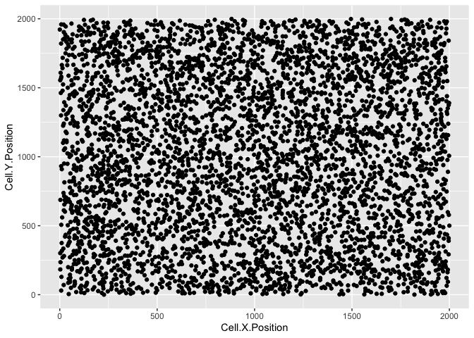
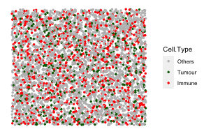

<!-- README.md is generated from README.Rmd. Please edit that file -->

# spaSim

<!-- badges: start -->
<!-- badges: end -->

The goal of spaSim (**spa**tial **Sim**ulator) is to facilitate tissue
image simulations! It simulates cells with 2D locations (point data) and
cell types in a tissue. The available patterns include background cells,
cell clusters, immune cell rings and vessels. It also enables
simulations that generate a set of images in one run!

As quantitative tools for spatial tissue image analysis have been
developed and need benchmarking, simulations from spaSim can be applied
to test and benchmark these tools and metrics. The output of spaSim are
images in `SpatialExperiment` object format and can be used with SPIAT.
SPIAT (**Sp**atial **I**mage **A**nalysis of **T**issues) is also
developed by our team.

## Installation

To install this package, start R and enter:

``` r
if (!require("BiocManager", quietly = TRUE))
    install.packages("BiocManager")

BiocManager::install("spaSim")
```

You can install the development version of spaSim like so:

``` r
install.packages("devtools")
devtools::install_github("TrigosTeam/spaSim")
```

## Vignette

The vignette with an overview of the package can be accessed from the
top Menu under Articles or clicking
[here](https://trigosteam.github.io/spaSim/articles/vignette.html).

## Example

This is a basic example which shows how to simulate background cells
with multiple cell types of different proportions.

``` r
library(spaSim)
set.seed(610)
mix_background <- TIS(n_cells = 5000, width = 2000, height = 2000, 
                      bg_method = "Hardcore", min_d = 10,
                      names_of_bg_cells = c("Tumour","Immune","Others"),
                      proportions_of_bg_cells = c(0.1, 0.2, 0.7),
                      plot_image = TRUE)
```

<!-- --><!-- -->

## Creators

spaSim was created, designed and implemented by Yuzhou Feng. Anna Trigos
provided supervision and guidance.
