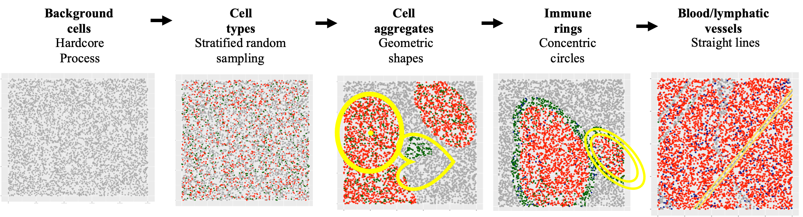

  
```{r setup, include = FALSE}
knitr::opts_chunk$set(
  collapse = TRUE,
  comment = "#>",
  crop = NULL ## Related to https://stat.ethz.ch/pipermail/bioc-devel/2020-April/016656.html
)
```


```{r vignetteSetup, echo=FALSE, message=FALSE, warning = FALSE}
## Track time spent on making the vignette
startTime <- Sys.time()
## Bib setup
library("RefManageR")
## Write bibliography information
bib <- c(
  R = citation(),
  BiocStyle = citation("BiocStyle")[1],
  knitr = citation("knitr")[1],
  RefManageR = citation("RefManageR")[1],
  rmarkdown = citation("rmarkdown")[1],
  sessioninfo = citation("sessioninfo")[1],
  testthat = citation("testthat")[1],
  spaSim = citation("spaSim")[1]
)
```

# Basics

spaSim (**spa**tial **Sim**ulator) is a simulator of tumor immune microenvironment spatial data. It includes a family of functions to simulate a diverse set of cell localization patterns in tissues. Patterns include background cells (one cell type or multiple cell types of different proportions), tumour/immune clusters, immune rings and double immune rings and stripes (blood/lymphatic vessels). 

As quantitative tools for spatial tissue image analysis have been developed and need benchmarking, simulations from spaSim can be applied to test and benchmark these tools and metrics. The output of spaSim are images in SingleCellExperiment object format and can be used with SPIAT (SPIAT (**Sp**atial **I**mage **A**nalysis of **T**issues) also developed by our team.

It would be good to have a section at the end where you input the spaSim to SPIAT.

## Installing `spaSim`

`r Biocpkg("spaSim")` is a `R` package available via the [Bioconductor](http://bioconductor.org) repository for packages. You can install the lasted development version from Github. You can install spaSim using the following commands in your `R` session:
  
  
```{r "install"}
# ## Check that you have a valid Bioconductor installation
# BiocManager::valid()

# if (!requireNamespace("BiocManager", quietly = TRUE)) {
#       install.packages("BiocManager")
#   }
# 
# BiocManager::install("spaSim")
# 

## install from GitHub
# install.packages("devtools")
# devtools::install_github("TrigosTeam/spaSim", ref = "main")
library(spaSim) 
```

## Required knowledge
`r Biocpkg("spaSim")` uses multiple other packages and in particular those that have implemented the infrastructure needed for cell data. That is, packages like `r Biocpkg("SingleCellExperiment")`.

If you are asking yourself the question "Where do I start using Bioconductor?" you might be interested in [this blog post](http://lcolladotor.github.io/2014/10/16/startbioc/#.VkOKbq6rRuU).

## Citing `spaSim`
We hope that `r Biocpkg("spaSim")` will be useful for your research. Please use the following information to cite the package and the overall approach. Thank you!
```{r "citation"}
## Citation info
citation("spaSim")
```

# Quick start to using `spaSim`                                                                 
## Simulate an individual image
In spaSim, spatial patterns are simulated on separate layers sequentially starting from 'background cells' which serve as the canvas for higher order structures (e.g. tumour clusters, immune clusters and immune rings can be simulated after/on top of background cells). Here we will go through each of these steps.
                                                                                                         
### Simulate background cells
First we randomly generate the spatial locations of generic 'background cells' (without cell identities). The 'background cells' will serve as the input to the other simulation functions shown below which can assign new identities to these cells in a structured or unstructured way.

Background images are simulated with a Hardcore Process, which is a Poisson process where events (i.e. cells) are maintained at a specific minimum distance from each other. As `rHardcore` from `spatstat.random` package deletes cells based on this requirement, our function uses a `oversampling_rate` to create more cells than the target number of cells (`n_cells`) to ensure the resulting image has the number of cells specified. If the resulting image ends up with slightly fewer cells than specified, increase the `oversampling_rate` argument to account for this. 

```{r}
set.seed(610)
bg <- simulate_background_cells(n_cells = 5000,
                                width = 2000,
                                height = 2000,
                                min_d = 10,
                                oversampling_rate = 1.6,
                                Phenotype="Others")
head(bg)
# use dim(bg)[1] to check if the same number of cells are simulated. 
# if not, increase `oversampling_rate`
dim(bg)[1]
```

### Simulate mixed background
To randomly assign 'background cells' to the the specified cell identities in the specified proportions in an unstructured manner, spaSim includes the `simulate_mixing` function.

Users can use the background image they defined earlier (e.g. `bg`), or the image predefined in the package (`bg1`) as the 'background cells' to further construct the mixed cell identities. In this example, we use `bg` that was defined in the previous section.
                                                                                                                           
The `props` argument defines the proportions of each cell type in `idents`. Although the proportions are specified, the exact cells that are assigned by each identity are stochastic. Therefore, users are encouraged to use the set.seed() function to ensure reproducibility. 
```{r}
mix_bg <- simulate_mixing(bg_sample = bg,
                          idents = c("Tumour", "Immune", "Others"),
                          props = c(0.2, 0.3, 0.5), 
                          plot_image = TRUE,
                          plot_colours = c("red","darkgreen","lightgray"))
```
                                                                                                                           
### Simulate clusters
This function aims to simulate cells that aggregate as clusters like tumour clusters or immune clusters. Tumour clusters can be circles or ovals (or merging several ovals/circles together), and immune clusters are irregular (or merging several irregular shapes together).

First, we specify the properties of clusters such their primary cell type, size, shape and location. If infiltrating cell types are required, we can also include their properties. 

If there are multiple cell types lying in the cluster (e.g. tumour cells and infiltrating cells), the assignment of identities to these cells is random, using the random number sampling technique.

```{r}
cluster_properties <- list(
  C1 =list(name_of_cluster_cell = "Tumour", size = 500, shape = "Oval", 
           centre_loc = data.frame(x = 600, y = 600),infiltration_types = c("Immune1", "Others"), 
           infiltration_proportions = c(0.1, 0.05)), 
  C2 = list(name_of_cluster_cell = "Immune1", size = 600,  shape = "Irregular", 
            centre_loc = data.frame(x = 1500, y = 500), infiltration_types = c("Immune", "Others"),
            infiltration_proportions = c(0.1, 0.05)))
# can use any defined image as background image, here we use mix_bg defined in the previous section
clusters <- simulate_clusters(bg_sample = mix_bg,
                              n_clusters = 2,
                              bg_type = "Others",
                              win = NULL,
                              cluster_properties = cluster_properties,
                              plot_image = TRUE,
                              plot_categories = c("Tumour" , "Immune", "Immune1", "Others"),
                              plot_colours = c("red", "darkgreen", "darkblue", "lightgray"))
```

The simulated image shows a tumour cluster and an immune cluster on a mixed background image. The primary cell type of the tumour cluster is "Tumour", with some "Immune1" and "Others" cells also within the tumour cluster. The primary cell type of the immune cluster is "Immune1", with some "Immune2" and "Others" cells also within the immune cluster. 

### Simulate immune rings
This function aims to simulate tumour clusters and an immune ring surrounding each of the clusters, which represent immune cells excluded to the tumor margin.
                                                                                                        
First, we specify the properties of immune rings such their primary (inner cluster) and secondary (outer ring) cell types, size, shape, width and location. Properties of cells infiltrating into the inner mass or outer ring can also be set. 

If there are multiple cell types lying in the cluster and the immune ring, the assignment of identities to these cells is random, using the random number sampling technique.

```{r}
immune_ring_properties <- list(
  I1 = list(name_of_cluster_cell = "Tumour", size = 500, 
            shape = "Circle", centre_loc = data.frame(x = 930, y = 1000), 
            infiltration_types = c("Immune1", "Immune2", "Others"), 
            infiltration_proportions = c(0.15, 0.05, 0.05),
            name_of_ring_cell = "Immune1", immune_ring_width = 150,
            immune_ring_infiltration_types = c("Immune2", "Others"), 
            immune_ring_infiltration_proportions = c(0.1, 0.15)))
rings <- simulate_immune_rings(
  bg_sample = bg,
  bg_type = "Others",
  n_ir = 1,
  win = NULL,
  ir_properties = immune_ring_properties,
  plot_image = TRUE,
  plot_categories = c("Tumour", "Immune1", "Immune2", "Others"),
  plot_colours = c("red", "darkgreen", "darkblue", "lightgray"))
```

spaSim also allows simulation of two shapes overlapping each other. An algorithm is then used to make the inner mass and outer rings of the different shapes cohesive. An example is shown below. Overlapping of shapes is also possible for clusters and double rings.

```{r}
immune_ring_properties <- list( 
  I1 = list(name_of_cluster_cell = "Tumour", size = 500, 
            shape = "Circle", centre_loc = data.frame(x = 930, y = 1000), 
            infiltration_types = c("Immune1", "Immune2", "Others"), 
            infiltration_proportions = c(0.15, 0.05, 0.05),
            name_of_ring_cell = "Immune1", immune_ring_width = 150,
            immune_ring_infiltration_types = c("Immune2", "Others"), 
            immune_ring_infiltration_proportions = c(0.1, 0.15)), 
  I2 = list(name_of_cluster_cell = "Tumour", size = 400, shape = "Oval",
           centre_loc = data.frame(x = 1330, y = 1100), 
           infiltration_types = c("Immune1",  "Immune2", "Others"), 
           infiltration_proportions = c(0.15, 0.05, 0.05),
           name_of_ring_cell = "Immune1", immune_ring_width = 150,
           immune_ring_infiltration_types = c("Immune2","Others"), 
           immune_ring_infiltration_proportions = c(0.1, 0.15)))

rings <- simulate_immune_rings(bg_sample = bg,
                              bg_type = "Others",
                              n_ir = 2,
                              win = NULL,
                              ir_properties = immune_ring_properties,
                              plot_image = TRUE,
                              plot_categories = c("Tumour", "Immune1", "Immune2", "Others"),
                              plot_colours = c("red", "darkgreen", "darkblue", "lightgray"))
```

### Simulate double rings
This function aims to simulate tumour clusters with an inner ring (internal tumour margin) and an outer ring (external tumour margin).

First, we specify the properties of double rings such their primary (inner mass), secondary (inner ring), and tertiary (outer ring) cell types, size, shape, width and location. Properties of cells infiltrating into the inner mass or either ring can also be set. If there are multiple cell types lying in the tumour cluster and the double rings, the assignment of identities to the cells is random, using the random number sampling technique.

Similar to the above case, we are placing two double immune rings that overlap with each other to form a more complex shape.

```{r}
double_ring_properties <- list(
 I1 = list(name_of_cluster_cell = "Tumour", size = 300, shape = "Circle", 
           centre_loc = data.frame(x = 1000, y = 1000), 
           infiltration_types = c("Immune1", "Immune2", "Others"), 
           infiltration_proportions = c(0.15, 0.05, 0.05), 
           name_of_ring_cell = "Immune1", immune_ring_width = 80,
           immune_ring_infiltration_types = c("Tumour", "Others"), 
           immune_ring_infiltration_proportions = c(0.1, 0.15), 
           name_of_double_ring_cell = "Immune2", double_ring_width = 100,
           double_ring_infiltration_types = c("Others"), 
           double_ring_infiltration_proportions = c( 0.15)),      
 I2 = list(name_of_cluster_cell = "Tumour", size = 300, shape = "Oval",
           centre_loc = data.frame(x = 1200, y = 1200), 
           infiltration_types = c("Immune1", "Immune2", "Others"), 
           infiltration_proportions = c(0.15, 0.05, 0.05),
           name_of_ring_cell = "Immune1", immune_ring_width = 80,
           immune_ring_infiltration_types = c("Tumour","Others"), 
           immune_ring_infiltration_proportions = c(0.1,0.15), 
           name_of_double_ring_cell = "Immune2", double_ring_width = 100,
           double_ring_infiltration_types = c("Others"), 
           double_ring_infiltration_proportions = c(0.15)))
double_rings <- simulate_double_rings(bg_sample = bg1,
                                     bg_type = "Others",
                                     n_dr = 2,
                                     win = NULL,
                                     dr_properties = double_ring_properties,
                                     plot_image = TRUE,
                                     plot_categories = c("Tumour", "Immune1", "Immune2", "Others"),
                                     plot_colours = c("red", "darkgreen", "darkblue", "lightgray"))
```

The simulated image shows two layers of immune rings. The primary cell type in the inner ring (internal tumour margin) is coloured green, with some "Tumour" cells also lie in the inner ring. The outer ring (external tumour margin) is coloured blue, with some other "Others" cells also lie in the outer ring.

### Simulate vessels
This function aims to simulate stripes of cells representing blood/lymphatic vessels.
First, we specify the properties of vessel structures such as the number present, their width, and the properties of their infiltrating cells. We then randomly assign 'background cells' which lie within these vessel structures to the specified cell identities in the specified proportions.

The locations of the vessels are stochastic.

```{r}
properties_of_stripes = list(
 S1 = list(number_of_stripes = 1, name_of_stripe_cell = "Immune1", 
           width_of_stripe = 40, infiltration_types = c("Others"),
           infiltration_proportions = c(0.08)), 
 S2 = list(number_of_stripes = 5, name_of_stripe_cell = "Immune2", 
           width_of_stripe = 40, infiltration_types = c("Others"), 
           infiltration_proportions = c(0.08)))
vessles <- simulate_stripes(bg_sample = bg1,
                           n_stripe_type = 2,
                           win = NULL,
                           stripe_properties = properties_of_stripes,
                           plot_image = TRUE)
```

### Displaying the sequential construction of a simulated image
What does TIS stand for?
The `TIS` function simulates all possible patterns in one function. The patterns are simulated in the order of: background cells, mixed background cells, clusters (tumour/immune), immune rings, double immune rings, and vessels. 

```{r echo=FALSE, fig.align="center"}

```

Not all patterns are required for using this function. If a pattern is not needed, simply use `NULL` for the pattern arguments.
The example simulates a background sample with a tumour cluster and an immune ring on it.

```{r}
# First specify the cluster and immune ring properties
## tumour cluster properties
properties_of_clusters = list(
 C1 = list( name_of_cluster_cell = "Tumour", size = 300, shape = "Oval", 
            centre_loc = data.frame("x" = 500, "y" = 500),
            infiltration_types = c("Immune1", "Others"), 
            infiltration_proportions = c(0.3, 0.05)))
## immune ring properties
immune_ring_properties <- list( 
  I1 = list(name_of_cluster_cell = "Tumour", size = 300, 
            shape = "Circle", centre_loc = data.frame(x = 1030, y = 1100), 
            infiltration_types = c("Immune1", "Immune2", "Others"), 
            infiltration_proportions = c(0.15, 0.05, 0.05),
            name_of_ring_cell = "Immune1", immune_ring_width = 150,
            immune_ring_infiltration_types = c("Others"), 
            immune_ring_infiltration_proportions = c(0.15)), 
  I2 = list(name_of_cluster_cell = "Tumour", size = 200, shape = "Oval",
           centre_loc = data.frame(x = 1430, y = 1400), 
           infiltration_types = c("Immune1",  "Immune2", "Others"), 
           infiltration_proportions = c(0.15, 0.05, 0.05),
           name_of_ring_cell = "Immune1", immune_ring_width = 150,
           immune_ring_infiltration_types = c("Others"), 
           immune_ring_infiltration_proportions = c(0.15)))
# simulation
# no background sample is input, TIS simulates the background cells from scratch
# `n_cells`, `width`, `height`, `min_d` and `oversampling_rate` are parameters for simulating background cells
# `n_clusters`, `properties_of_clusters` are parameters for simulating clusters on top of the background cells
# `plot_image`, `plot_categories`, `plot_colours` are params for plotting
TIS(bg_sample = NULL,
   n_cells = 5000,
   width = 2000,
   height = 2000,
   min_d = 10,
   oversampling_rate = 1.6, 
   n_clusters = 1,
   properties_of_clusters = properties_of_clusters,
   n_immune_rings = 2,
   properties_of_immune_rings = immune_ring_properties,
   plot_image = TRUE,
   plot_categories = c("Tumour", "Immune1", "Immune2", "Others"),
   plot_colours = c("red", "darkgreen", "darkblue", "lightgray"))
```
How does it know how to combine the different items? I mean, why doesn't it output a single image with all of this, or splits the clusters between images? Do you know what I mean?

## Simulating a range of multiple images
In some cases simulations of a set of images that span a range of different properties of patterns are needed. Rather than simulating images individually, simulating these images in one go is desirable. The following functions create a quick interface to generate a range of images with different parameters/randomised elements.

### Simulate multiple background images (multiple cell types) with different proportions of cell types.

This function aims to simulate a set of images that contain different proportions of specified cell types.

In this example we simulate 4 images with 10% Tumour cells and an increasing number of Immune cells. We first specify the cell types and the proportions of each cell type in each image.
                                                                                                        
```{r}
#cell types present in each image
idents <- c("Tumour", "Immune", "Others")
# Each vector corresponds to each cell type in `idents`. 
# Each element in each vector is the proportion of the cell type in each image.
# (4 images, so 4 elements in each vector)
Tumour_prop <- rep(0.1, 4)
Immune_prop <- seq(0, 0.3, 0.1)
Others_prop <- seq(0.9, 0.6, -0.1)
# put the proportion vectors in a list
prop_list <- list(Tumour_prop, Immune_prop, Others_prop)

# simulate 
bg_list <- 
 multiple_background_images(bg_sample = bg, idents = idents, props = prop_list,
                            plot_image = TRUE, plot_colours = c("red", "darkgreen", "lightgray"))
```
                                                                                                                           
### Simulate multiple images with clusters of different properties.
This function aims to simulate a set of images that contain different tumour/immune clusters.

Note that in this function users cannot manually define the base shape and the primary cell type of the clusters. There are three options for the base shape available in the `cluster_shape` argument. "1" for a simple cluster where all cells are "Tumour", "2" for a tumour cluster where the primary cell type is "Tumour" and there is infiltration of types "Immune" and "Others", and "3" for an immune cluster where the primary cell type is "Immune" and the infiltration cell types are "Immune1" and "Others").
     
Here we simulate 4 images with increasing tumour cluster sizes using the cluster shape "1".

```{r}
# if a property is fixed, use a number for that parameter.
# if a property spans a range, use a numeric vector for that parameter, e.g.
range_of_size <- seq(200, 500, 100)
cluster_list <- 
 multiple_images_with_clusters(bg_sample = bg1,
                               cluster_shape = 1,
                               prop_infiltration = 0.1,
                               cluster_size = range_of_size,
                               cluster_loc_x = 0,
                               cluster_loc_y = 0,
                               plot_image = TRUE,
                               plot_categories = c("Tumour", "Immune", "Others"),
                               plot_colours = c("red", "darkgreen", "lightgray"))
```

We will also include one example for shape "2" and one example for shape "3".

Can you add a range for the proportion of infiltration?
```{r}
# shape "2" - Tumour cluster
multiple_images_with_clusters(bg_sample = bg1,
                               cluster_shape = 2,
                               prop_infiltration = 0.1,
                               cluster_size = 200,
                               cluster_loc_x = 0,
                               cluster_loc_y = 0,
                               plot_image = TRUE, 
                              plot_categories = c("Tumour" , "Immune", "Others"),
                              plot_colours = c("red","darkgreen", "lightgray"))
```

```{r}
# shape "3" - Immune cluster
multiple_images_with_clusters(bg_sample = bg1,
                               cluster_shape = 3,
                               prop_infiltration = 0.1,
                               cluster_size = 500,
                               cluster_loc_x = 0,
                               cluster_loc_y = 0,
                               plot_image = TRUE, 
                               plot_categories = c("Immune", "Others"),
                               plot_colours = c("darkgreen", "lightgray"))
```

### Simulate multiple images with immune rings of different properties
This function aims to simulate a set of images that contain different tumour clusters with immune rings.

Note that similar to `multiple_images_with_clusters`, in this function users cannot manually define the base shape and the primary cell type of the clusters or the immune rings. There are three options for the base shape available in the `ring`_shape` argument ("1", "2" and "3" where  the primary cluster cell type is "Tumour", cluster infiltration cell types are "Immune" and "Others", primary ring cell type is "Immune" and ring infiltration type is "Others") (better define which correspond to "1", "2" and "3" as it is not clear). The cluster size, infiltration proportions, cluster location, ring width, and ring infiltration proportions can be defined. (Do you mean that you can have a range of these as well?)

Here we show 3 images with increasingly wider immune rings. First define any parameter that has a range.

```{r}
# if a property is to be fixed, use a number for that parameter.
# if a property is to span a range, use a numeric vector for that parameter, e.g.
range_ring_width <- seq(50, 120, 30)
immune_ring_list <- 
 multiple_images_with_immune_rings(bg_sample = bg,
                                   cluster_size = 200,
                                   ring_shape = 1,
                                   prop_infiltration = 0,
                                   ring_width = range_ring_width,
                                   cluster_loc_x = 0,
                                   cluster_loc_y = 0,
                                   prop_ring_infiltration = 0.1,
                                   plot_image = TRUE,
                                   plot_categories = c("Tumour", "Immune", "Others"),
                                   plot_colours = c("red", "darkgreen", "lightgray"))
```

# Citation
Here is an example of you can cite the package.

* `r Biocpkg("spaSim")` `r Citep(bib[["spaSim"]])`


# Reproducibility

The `r Biocpkg("spaSim")` package `r Citep(bib[["spaSim"]])` was made possible thanks to:
 
 * R `r Citep(bib[["R"]])`
* `r Biocpkg("BiocStyle")` `r Citep(bib[["BiocStyle"]])`
* `r CRANpkg("knitr")` `r Citep(bib[["knitr"]])`
* `r CRANpkg("RefManageR")` `r Citep(bib[["RefManageR"]])`
* `r CRANpkg("rmarkdown")` `r Citep(bib[["rmarkdown"]])`
* `r CRANpkg("sessioninfo")` `r Citep(bib[["sessioninfo"]])`
* `r CRANpkg("testthat")` `r Citep(bib[["testthat"]])`

This package was developed using `r BiocStyle::Biocpkg("biocthis")`.


Code for creating the vignette

```{r createVignette, eval=FALSE}
## Create the vignette
library("rmarkdown")
system.time(render("vignette.Rmd", "BiocStyle::html_document"))
## Extract the R code
library("knitr")
knit("vignette.Rmd", tangle = TRUE)
```

Date the vignette was generated.

```{r reproduce1, echo=FALSE}
## Date the vignette was generated
Sys.time()
```

Wallclock time spent generating the vignette.

```{r reproduce2, echo=FALSE}
## Processing time in seconds
totalTime <- diff(c(startTime, Sys.time()))
round(totalTime, digits = 3)
```

`R` session information.
                                                                                                                   
```{r reproduce3, echo=FALSE}
## Session info
library("sessioninfo")
options(width = 120)
session_info()

```
# Bibliography
This vignette was generated using `r Biocpkg("BiocStyle")` `r Citep(bib[["BiocStyle"]])` with `r CRANpkg("knitr")` `r Citep(bib[["knitr"]])` and `r CRANpkg("rmarkdown")` `r Citep(bib[["rmarkdown"]])` running behind the scenes.Citations made with `r CRANpkg("RefManageR")` `r Citep(bib[["RefManageR"]])`.             

```{r vignetteBiblio, results = "asis", echo = FALSE, warning = FALSE, message = FALSE}
## Print bibliography
PrintBibliography(bib, .opts = list(hyperlink = "to.doc", style = "html"))
```
